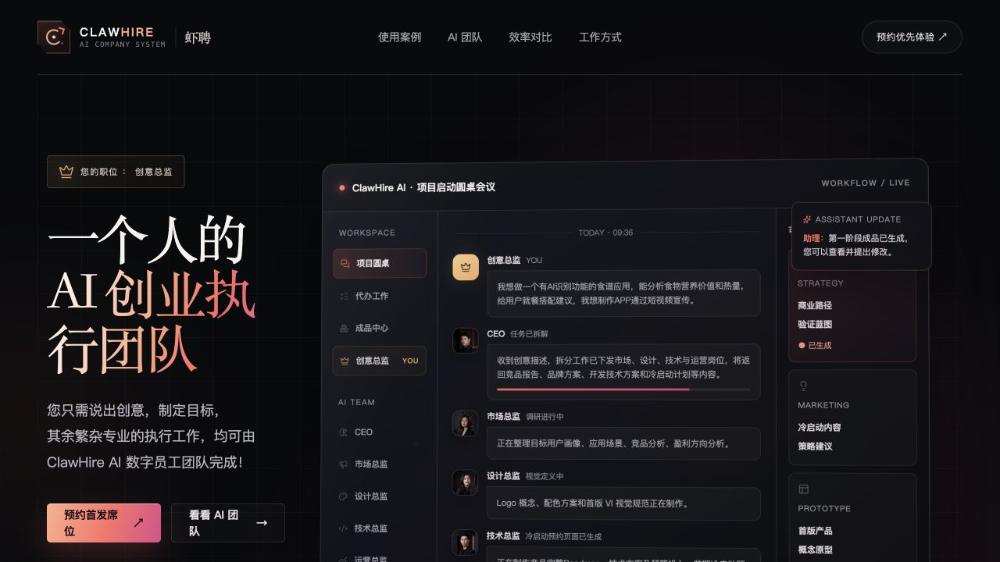
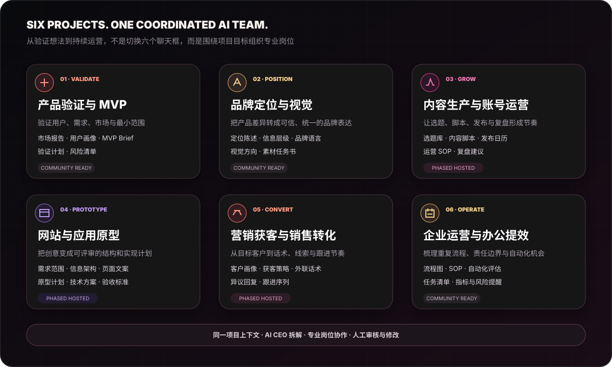
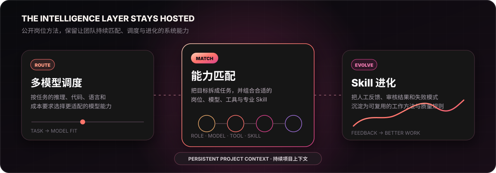

# ClawHire AI

### Not another folder of agents. A coordinated AI team that moves projects forward.

You set the goal and make key decisions. An AI CEO discovers the project, creates a plan and assembles specialized AI employees. Their work, reviews and revisions stay together in one workspace.

[🚀 Start in 2 minutes](./START_HERE.md#english-quick-start) · [⭐ Star and follow](https://github.com/clawhire-ai/clawhire) · [View a real example](#real-product-view) · [Apply for a paid invite](https://clawhireai.com/?utm_source=github&utm_medium=readme_en&utm_campaign=invite_application) · [中文](./README.md)

---

## The difference in one sentence

> **Open agent libraries answer “Which agent can I call?” ClawHire answers “How does an AI team keep a real project moving and deliver the result?”**

Many open-source AI employee projects publish role prompts, personas or installable agent files. They are excellent for learning and one-off work, but users usually still choose each role, pass context, decide the next step, resolve conflicts and combine the outputs.

ClawHire is project-centered. An AI CEO clarifies the goal, selects the right roles, coordinates execution and cross-review, while the system preserves consensus, progress, versions and deliverables. You stay in control at the decision points.

## Start with the Community Pack in 60 seconds

1. Pick the Community Agent closest to the decision in front of you.
2. Copy the full Markdown role into your preferred general-purpose AI tool.
3. Add your goal, evidence, constraints and required decision.
4. Review the output and manually pass useful context to the next Agent when needed.

For product validation, try Market Researcher → User Researcher → Product Strategist → Risk Reviewer. The [sanitized end-to-end example](./examples/ai-recipe-validation/README.md) shows the expected structure.

### Start from the decision in front of you

| Your goal | First entry point | What you should get |
|---|---|---|
| Validate a product idea | [Market Researcher](./community-agents/market-researcher.md) | Demand signals, alternatives and differentiation hypotheses |
| Scope an MVP | [Product Strategist](./community-agents/product-strategist.md) | Positioning, scope, non-goals and validation plan |
| Build a content plan | [Content Planner](./community-agents/content-planner.md) | Content pillars, topics and a one-week schedule |
| Improve an office process | [Office Process Analyst](./community-agents/office-process-analyst.md) | Bottlenecks, automation opportunities and priorities |
| Stress-test a plan | [Risk Reviewer](./community-agents/risk-reviewer.md) | Evidence gaps, major risks and the smallest next step |

[Open the two-minute guide and copy your first task card →](./START_HERE.md#english-quick-start)

## Who this is for

| Good fit | Not the right fit yet |
|---|---|
| Founders, independent builders and small teams making product, content, sales or operations decisions | Anyone looking for the complete SaaS backend or commercial platform source code |
| People who want to test the ClawHire method with useful public templates before applying | Anyone expecting the free pack to browse, email, deploy or publish automatically |
| Users willing to provide context, verify claims and retain control of key decisions | High-risk workflows that must run fully autonomously without human approval |

If you only need a role template, the Community Pack stands on its own. Hosted ClawHire is for persistent context, automatic team assembly, cross-role delivery and continued revisions.

## The roundtable is where coordination happens

This homepage **collaboration concept** follows an AI nutrition app project. The AI CEO clarifies and decomposes the goal; market, design and technical roles work from one project context; stage deliverables return to one workspace for human review and revision.

- One shared project context instead of repeated copy-and-paste between agents
- AI CEO discovery, task decomposition and sequencing
- Capability matching across roles, models and Skills
- Human control over direction, approval, return and adoption

> This image explains the roundtable collaboration concept. The “Real product view” below is a separate sanitized workspace from the working product.

## Six application scenarios

| Project scenario | Example roles | Primary deliverables |
|---|---|---|
| Product validation and MVP | Market, user, product, risk | Market brief, personas, MVP brief, validation plan |
| Brand positioning and visual direction | Market, brand, design, content | Position, messaging, visual direction, asset brief |
| Content production and account operations | Market, content, design, operations | Topics, scripts, publishing calendar, SOP, review plan |
| Website and app prototyping | Product, design, technical, risk | Scope, information architecture, page copy, prototype plan |
| Acquisition and sales conversion | Market, content, sales, support | Audience, acquisition plan, outreach, objections, follow-up |
| Business operations and office efficiency | Process, operations, finance, risk | Process map, SOP, automation assessment, risk checklist |

The Community Pack already supports research, planning, copy and review. Automated web research, code and deployment, media generation, publishing, email and spreadsheet actions roll out separately in the paid invite product.

## What is free

The intentionally lightweight **Community Pack** provides genuine standalone value:

| Public resource | Included | What it gives you |
|---|---:|---|
| Community Agents | 10 | Copy, modify and call them manually in compatible AI tools |
| Lite workflows | 3 | Manually coordinate several roles using our project method |
| Sanitized end-to-end example | 1 | See how four roles validate a product idea together |
| Roadmap, FAQ and community docs | Ongoing | Understand boundaries and contribute ideas |

These MIT-licensed resources do **not** include the complete AI CEO instructions, automatic planning and scheduling, persistent project state, multi-model routing, capability matching, Skill evolution, internal quality rules or the commercial platform source code.

## What the paid invite adds

Hosted ClawHire is not simply more Markdown files. It is the system that keeps the team operating.

| Capability | Free Community Pack | Paid hosted ClawHire |
|---|---:|---:|
| Lightweight role templates and manual one-off use | ✓ | ✓ |
| Broader, continuously expanding professional role library | — | ✓ |
| Dynamic AI CEO discovery and project consensus | — | ✓ |
| Automatic role selection and task planning | — | ✓ |
| Multi-model orchestration for task-fit capabilities | — | ✓ |
| Capability matching across roles, models, tools and Skills | — | ✓ |
| Skill evolution from feedback and quality review | — | ✓ |
| Shared context and coordinated multi-role delivery | Manual | ✓ |
| Persistent progress, deliverables and versions | — | ✓ |
| Cross-review, human approval and continued revisions | — | ✓ |
| Deliverable center, usage credits and hosted operations | — | ✓ |

> Invite capabilities roll out by account and cohort. Current availability is stated clearly during onboarding.

These capabilities require ongoing orchestration, model calls, project state, storage, permissions and service operations. We open useful methods and templates while keeping the operating system behind the subscription product.

> Open registration is unavailable. Approved applicants receive a one-time invite code by email or direct contact.

[Apply for an invite →](https://clawhireai.com/?utm_source=github&utm_medium=readme_en&utm_campaign=invite_application)

## Real product view

This is a sanitized ClawHire project workspace, not a conceptual mockup. An AI CEO coordinates market research, user research, product strategy and risk review for an AI nutrition product validation project.

[View the complete sanitized example](./examples/ai-recipe-validation/README.md).

## Community Agents

| Agent | Best used for |
|---|---|
| [Market Researcher](./community-agents/market-researcher.md) | Demand, competitors and differentiation |
| [User Researcher](./community-agents/user-researcher.md) | User segments, pain points and validation questions |
| [Product Strategist](./community-agents/product-strategist.md) | Positioning, MVP scope and validation |
| [Content Planner](./community-agents/content-planner.md) | Content positioning, topics and weekly plans |
| [Office Process Analyst](./community-agents/office-process-analyst.md) | Workflows, SOPs and automation opportunities |
| [Risk Reviewer](./community-agents/risk-reviewer.md) | Evidence, logic, scope and major risks |
| [Brand Positioning Advisor](./community-agents/brand-positioning-advisor.md) | Positioning, message hierarchy and creative direction |
| [Sales Message Advisor](./community-agents/sales-message-advisor.md) | Outreach, discovery and follow-up drafts |
| [Customer Feedback Analyst](./community-agents/customer-feedback-analyst.md) | Traceable themes and decision support |
| [Project Scope Reviewer](./community-agents/project-scope-reviewer.md) | Deliverables, dependencies and acceptance criteria |

Every public Agent is stateless and requires manual context. It does not select other roles, call tools, share project memory, route models or evolve Skills automatically.

## Manual workflows

- [Product Brief Lite](./workflows/product-brief-lite.md)
- [Weekly Content Plan Lite](./workflows/weekly-content-plan-lite.md)
- [Office Automation Assessment Lite](./workflows/office-automation-assessment-lite.md)

## Current product boundary

The invite build currently focuses on discovery, planning, multi-role collaboration and versioned text/Markdown deliverables. Web research, code execution, deployment, media production and external email, spreadsheet or publishing actions remain in development. Roadmap capabilities are not presented as already available.

## Community and license

### Why Star this repository

This repository will continue to collect standalone Community Agents, Lite workflows, sanitized project examples and transparent free-versus-hosted boundaries. A Star makes it easy to return and helps us see which public scenarios deserve the most attention.

- Read the [Roadmap](./ROADMAP.md), [FAQ](./FAQ.md) and [Changelog](./CHANGELOG.md).
- Share scenarios and ideas in [Discussions](https://github.com/clawhire-ai/clawhire/discussions).
- Read the [Contributing Guide](./CONTRIBUTING.md) and [Security Policy](./SECURITY.md).

Public templates and documentation use the [MIT License](./LICENSE). The hosted platform remains commercial and its core source code is not included. The ClawHire name, logo and brand assets are excluded from the MIT grant; see [Trademark](./TRADEMARK.md).

**The free pack gives you the method. The paid product keeps the team running.**

[Website](https://clawhireai.com/?utm_source=github&utm_medium=readme_en&utm_campaign=website) · [Apply for an invite](https://clawhireai.com/?utm_source=github&utm_medium=readme_en&utm_campaign=invite_application) · [service@clawhireai.com](mailto:service@clawhireai.com)

