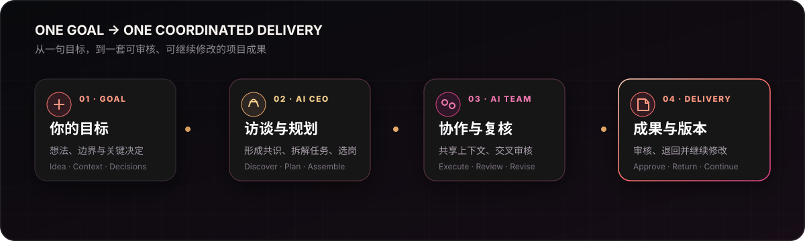
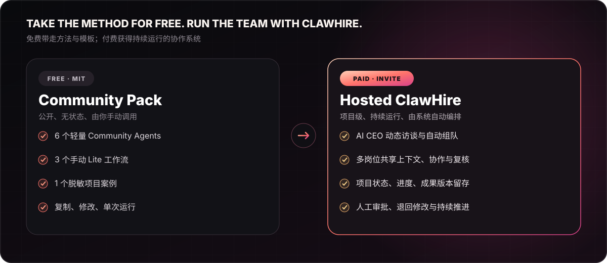

# ClawHire AI｜虾聘

### 不是再给你一堆 Agent，而是把一支 AI 团队组织起来交付结果

你提出目标并确认关键方向。AI CEO 负责访谈、规划和组队，专业数字员工协作产出，成果进入统一工作台供你审核、退回和继续修改。

[⭐ Star 并关注更新](https://github.com/clawhire-ai/clawhire) · [先用免费 Community Pack](#免费公开了什么) · [查看真实案例](#真实产品画面) · [申请付费版邀请码](https://clawhireai.com/?utm_source=github&utm_medium=readme&utm_campaign=invite_application) · [English](./README.en.md)

---

## 一句话看懂区别

> **角色库型开源项目解决“我能调用哪些 Agent”；ClawHire 解决“一个真实项目如何由 AI 团队持续推进并交付”。**

许多开源数字员工项目公开岗位提示词、角色设定或安装包。它们非常适合学习、组合和单次调用，但通常仍由用户负责选择角色、传递上下文、判断下一步、解决冲突并汇总结果。

ClawHire 以“项目”而不是“提示词文件”为中心：AI CEO 先理解目标，再选择合适岗位、安排执行顺序和交叉审核；系统保存项目共识、进度、版本与成果，你只需要在关键节点作决定。

## 免费公开了什么

本仓库提供真实可用、但刻意保持轻量的 **Community Pack**：

| 免费内容 | 数量 | 你可以做什么 |
|---|---:|---|
| [Community Agents](#community-agents) | 6 | 复制、修改并在任意兼容 AI 工具中单次调用 |
| [Lite 工作流](#三个手动工作流) | 3 | 手动串联多个岗位，体验我们的项目方法 |
| [脱敏完整案例](./examples/ai-recipe-validation/README.md) | 1 | 查看市场、用户、产品和风险岗位如何共同验证项目 |
| Roadmap、FAQ 与社区文档 | 持续更新 | 了解边界、提议场景并参与讨论 |

这些公开资产采用 MIT License。它们**不包含**完整 AI CEO 提示词、自动规划与调度、长期项目状态、模型路由、内部质检规则或商业平台源代码。

## 付费邀请版多了什么

付费版不是“更多 Markdown 文件”，而是由 ClawHire 托管运行的项目协作系统。

| 能力 | 免费 Community Pack | ClawHire 付费邀请版 |
|---|---:|---:|
| 轻量岗位模板、手动单次使用 | ✓ | ✓ |
| 更完整且持续扩展的专业岗位库 | — | ✓ |
| AI CEO 动态访谈与项目共识 | — | ✓ |
| 根据项目自动选择岗位、拆解任务 | — | ✓ |
| 多岗位共享上下文并协作交付 | 需人工 | ✓ |
| 项目状态、进度和成果版本留存 | — | ✓ |
| 交叉审核、人工审批、退回与继续修改 | — | ✓ |
| 成果中心、用量额度与托管服务 | — | ✓ |

### 为什么这些能力不免费开放

它们依赖持续运行的多智能体编排、模型调用、项目状态、存储、权限和服务运营，也是 ClawHire 订阅业务的核心价值。我们公开足以独立使用的模板和方法，但保留让 AI 团队真正持续运转的托管系统。

> ClawHire 目前不开放自由注册。通过官网提交申请并经人工审核后，我们会通过邮件或人工方式发送一次性邀请码。

[申请邀请码 →](https://clawhireai.com/?utm_source=github&utm_medium=readme&utm_campaign=invite_application)

## 真实产品画面

下面是脱敏后的 ClawHire 项目工作台，而不是概念效果图。示例项目中，AI CEO 组织市场研究、用户研究、产品策略和风险审核岗位，共同完成 AI 食谱产品的市场验证。

工作台集中展示项目 Brief、参与团队、CEO 执行计划、任务进度和经过审核的成果版本。你可以[查看完整脱敏案例](./examples/ai-recipe-validation/README.md)。

## Community Agents

| Agent | 适用场景 |
|---|---|
| [市场研究员](./community-agents/market-researcher.md) | 验证需求、竞品和差异化机会 |
| [用户研究员](./community-agents/user-researcher.md) | 整理用户画像、痛点和验证问题 |
| [产品策略师](./community-agents/product-strategist.md) | 定义定位、MVP 和验证计划 |
| [内容策划师](./community-agents/content-planner.md) | 建立内容定位、选题和一周计划 |
| [办公流程分析师](./community-agents/office-process-analyst.md) | 梳理重复工作、SOP 和自动化机会 |
| [风险审核员](./community-agents/risk-reviewer.md) | 检查证据、逻辑、边界和主要风险 |

每个 Agent 都是公开、无状态、需要人工提供上下文的社区版工作模板。它们展示 ClawHire 的岗位方法，但不代表付费版岗位数量或完整能力。

## 三个手动工作流

- [产品项目 Brief Lite](./workflows/product-brief-lite.md)：把产品想法整理成可验证的 MVP 计划。
- [一周内容运营计划 Lite](./workflows/weekly-content-plan-lite.md)：建立一周选题、内容和复盘安排。
- [办公流程自动化评估 Lite](./workflows/office-automation-assessment-lite.md)：判断重复流程是否适合自动化。

## 当前可用边界

当前邀请测试版重点提供项目访谈、规划、多岗位协作，以及文本/Markdown 成果的版本化交付。网页研究、代码执行、自动部署、图片视频制作，以及邮箱、在线表格和内容平台的外部执行仍在开发中；Roadmap 能力不会被描述为已经上线。

## Roadmap 与社区

- 查看 [Roadmap](./ROADMAP.md)、[FAQ](./FAQ.md) 和 [更新日志](./CHANGELOG.md)。
- 在 [Discussions](https://github.com/clawhire-ai/clawhire/discussions) 分享项目场景或提出建议。
- 通过 Issue 报告公开模板的问题。
- 阅读 [贡献指南](./CONTRIBUTING.md) 和 [安全说明](./SECURITY.md)。

请勿在公开 Issue 或 Discussion 中提交真实客户信息、账号凭证、商业机密或其他敏感数据。

## 许可证与品牌

本仓库公开模板和文档使用 [MIT License](./LICENSE)。ClawHire 托管平台仍为商业软件，其核心源代码不包含在本仓库中。ClawHire 名称、Logo 与品牌标识不随 MIT License 授权，详见 [品牌说明](./TRADEMARK.md)。

**免费版让你带走方法和模板；付费版替你把团队真正运转起来。**

[官网](https://clawhireai.com/?utm_source=github&utm_medium=readme&utm_campaign=website) · [申请邀请码](https://clawhireai.com/?utm_source=github&utm_medium=readme&utm_campaign=invite_application) · [service@clawhireai.com](mailto:service@clawhireai.com)

