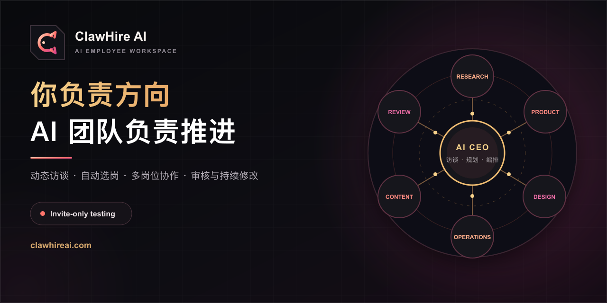
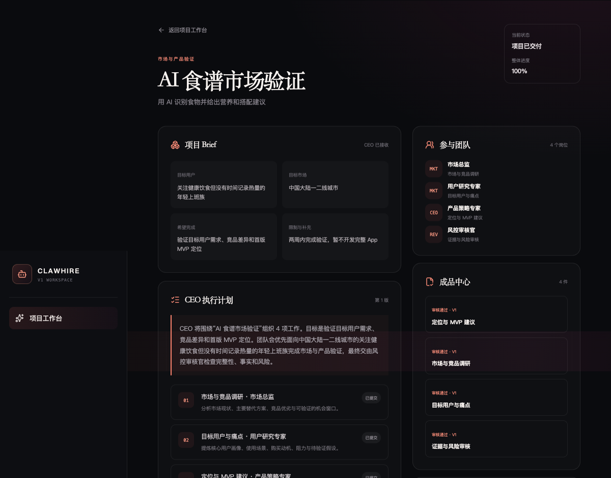

<div align="center">



# ClawHire AI｜虾聘

### 你负责创意和方向，AI 数字员工团队负责推进

从一句想法开始，由 AI CEO 理清目标、拆分工作，并组织研究、产品、设计、技术、运营等数字员工协作，提交可查看、审核和继续修改的成果。

[⭐ Star 并关注更新](https://github.com/clawhire-ai/clawhire) · [浏览 Community Agents](#community-agents) · [申请邀请码](https://clawhireai.com/?utm_source=github&utm_medium=readme&utm_campaign=invite_application) · [English](./README.en.md)

</div>

## ClawHire 是什么

普通 AI 工具往往在回答结束后，把后续执行留给用户。ClawHire 希望提供另一种工作方式：你提出目标、确认方向和审核结果，AI 数字员工团队负责规划、分工、制作和持续推进。

```text
说出想法与目标
      ↓
AI CEO 访谈并形成项目共识
      ↓
研究 / 产品 / 设计 / 技术 / 运营等岗位协作
      ↓
提交成果、交叉审核并根据意见修改
```

> ClawHire 目前处于邀请测试阶段，不开放自由注册。提交申请并通过人工审核后，我们会通过邮件或人工方式发送一次性邀请码。

## Community Agents

本仓库开放 6 个可复制、可修改、可单次使用的社区版数字员工：

| Agent | 适用场景 |
|---|---|
| [市场研究员](./community-agents/market-researcher.md) | 验证需求、竞品和差异化机会 |
| [用户研究员](./community-agents/user-researcher.md) | 整理用户画像、痛点和验证问题 |
| [产品策略师](./community-agents/product-strategist.md) | 定义定位、MVP 和验证计划 |
| [内容策划师](./community-agents/content-planner.md) | 建立内容定位、选题和一周计划 |
| [办公流程分析师](./community-agents/office-process-analyst.md) | 梳理重复工作、SOP 和自动化机会 |
| [风险审核员](./community-agents/risk-reviewer.md) | 检查证据、逻辑、边界和主要风险 |

它们是公开、无状态、需要人工调用的工作模板，不包含 ClawHire 托管产品的动态访谈、自动岗位选择、项目状态和多岗位编排。

## 三个手动工作流

- [产品项目 Brief Lite](./workflows/product-brief-lite.md)：把产品想法整理成可验证的 MVP 计划。
- [一周内容运营计划 Lite](./workflows/weekly-content-plan-lite.md)：建立一周选题、内容和复盘安排。
- [办公流程自动化评估 Lite](./workflows/office-automation-assessment-lite.md)：判断重复流程是否适合自动化。

## 产品演示



[查看脱敏案例](./examples/ai-recipe-validation/README.md)：验证一个面向年轻上班族的 AI 营养食谱产品。AI CEO 组织市场、用户研究、产品策略和风险审核岗位完成一轮项目交付。

## Community Pack 与托管产品

ClawHire 是订阅制商业托管产品，核心多智能体编排平台不在本仓库中。

### 与常见开源数字员工项目有什么区别

许多开源数字员工项目公开的是岗位提示词、角色设定或“员工说明书”。这些内容很适合学习和单次使用，但通常需要用户自己判断应该调用谁、逐个传递上下文、处理岗位冲突，并人工整合最终结果。

ClawHire 不只是提供更多 Agent。托管产品拥有更完整且持续扩展的专业岗位库，并由 AI CEO 根据真实项目动态访谈、形成共识、自动选择岗位、组织多 Agent 协作、保存项目状态、安排交叉审核，并根据你的意见继续修改和推进。你购买的是一套持续工作的 AI 团队系统，而不是一组静态提示词文件。

本仓库公开的 6 个 Community Agents 是 ClawHire 岗位体系中的轻量社区版本，用于展示我们的工作方法并提供真实可用价值；它们不代表付费版岗位数量或完整能力。

| 能力 | GitHub Community Pack | ClawHire 托管产品 |
|---|---:|---:|
| 基础任务模板 | ✓ | ✓ |
| 手动单次执行 | ✓ | ✓ |
| 更完整且持续扩展的专业岗位库 | — | ✓ |
| AI CEO 动态访谈 | — | ✓ |
| 多岗位自动协作 | — | ✓ |
| 项目状态与持续推进 | — | ✓ |
| 审批、返工与成果中心 | — | ✓ |
| 模型路由、额度与服务运营 | — | ✓ |

如果你只想学习或手动运行轻量工作流，可以直接使用本仓库。如果希望 AI 团队自动访谈、选择岗位、保存状态、协作交付并持续修改，可以[申请 ClawHire 邀请码](https://clawhireai.com/?utm_source=github&utm_medium=readme&utm_campaign=invite_application)。

## 当前边界

当前邀请测试版主要提供项目规划和文本/Markdown 成果交付。网页研究、代码执行、自动部署、图片视频制作，以及邮箱、在线表格和内容平台的外部执行仍在开发中；我们不会把 Roadmap 能力描述为已经上线。

## Roadmap 与社区

- 查看 [Roadmap](./ROADMAP.md) 和 [更新日志](./CHANGELOG.md)。
- 在 Discussions 分享希望 AI 团队推进的项目，或提出功能与场景建议。
- 通过 Issue 报告公开模板的问题。
- 阅读 [贡献指南](./CONTRIBUTING.md) 和 [安全说明](./SECURITY.md)。

请勿在公开 Issue 或 Discussion 中提交真实客户信息、账号凭证、商业机密或其他敏感数据。

## 许可证与品牌

本仓库公开模板和文档使用 [MIT License](./LICENSE)。ClawHire 托管平台仍为商业软件，其核心源代码不包含在本仓库中。ClawHire 名称、Logo 与品牌标识不随 MIT License 授权，详见 [品牌说明](./TRADEMARK.md)。

## 联系我们

- 官网：[clawhireai.com](https://clawhireai.com/?utm_source=github&utm_medium=readme&utm_campaign=website)
- 邀请测试：[申请邀请码](https://clawhireai.com/?utm_source=github&utm_medium=readme&utm_campaign=invite_application)
- 联系邮箱：[service@clawhireai.com](mailto:service@clawhireai.com)

<div align="center">

**你负责确认方向，AI 团队负责推进。**

</div>
